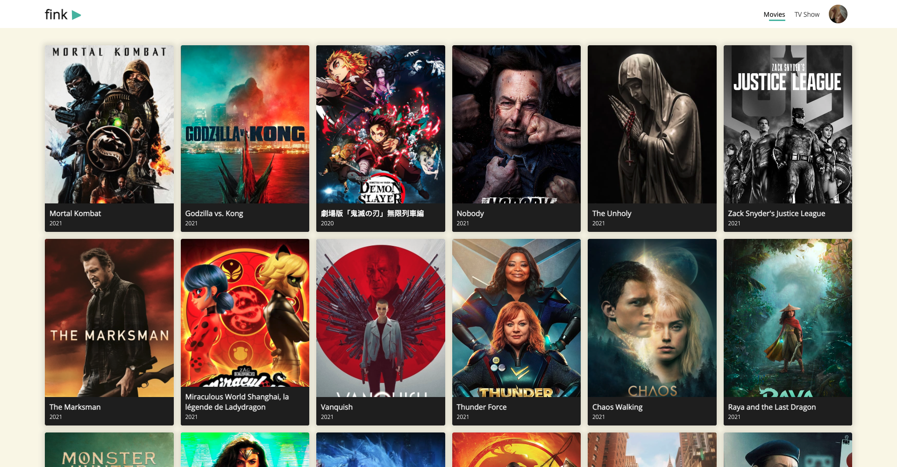
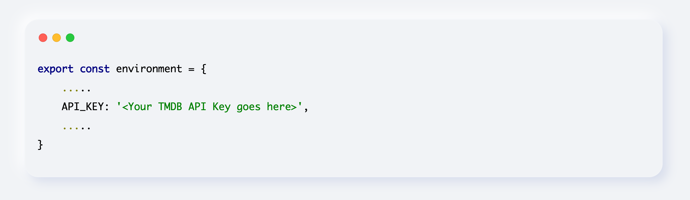
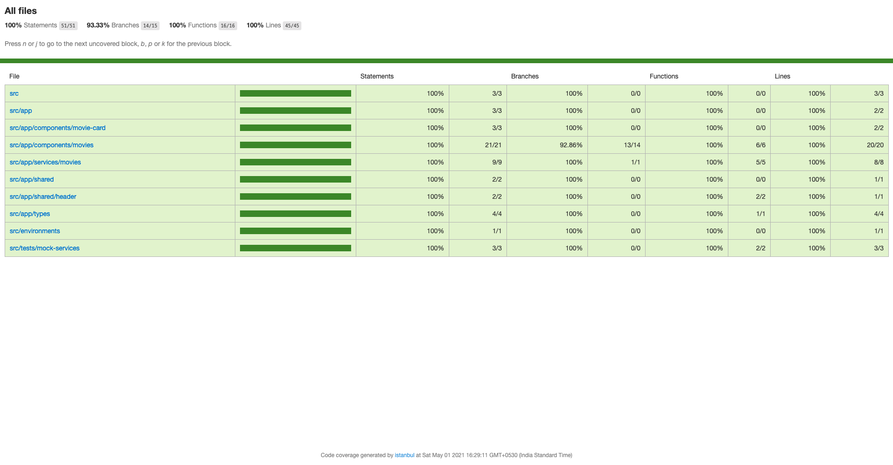
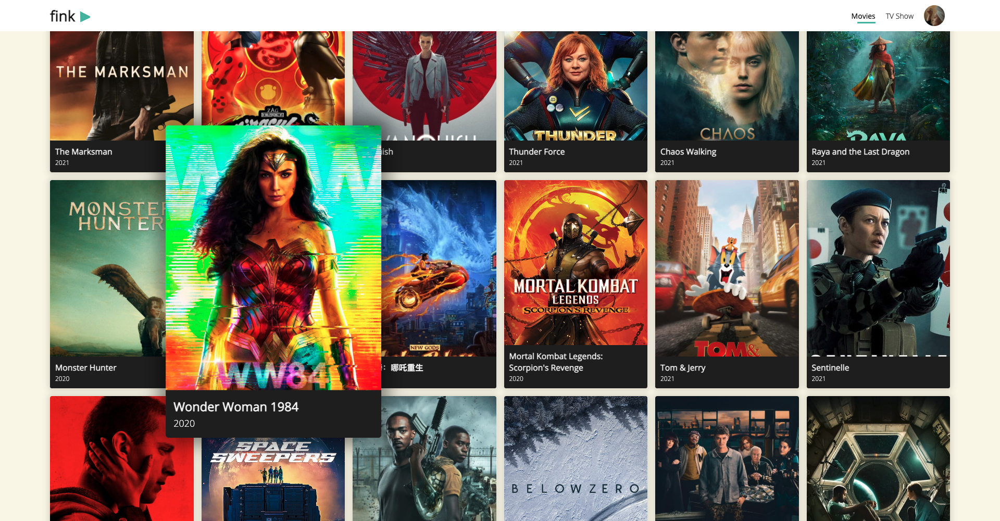
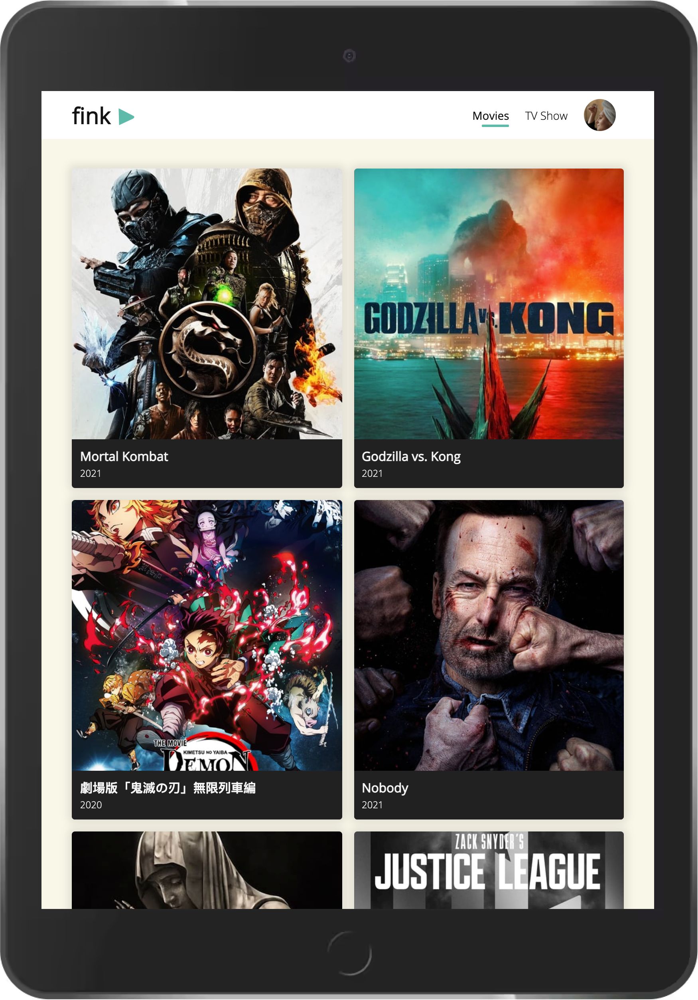
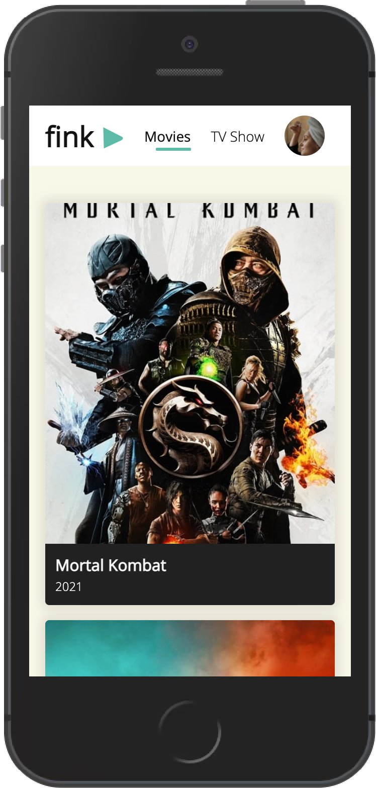

# Fink (Movie Dashboard)
Fink is a movie dashboard powered by [TMDB's](https://developers.themoviedb.org/3/movies/get-popular-movies) popular movies API.
Demo URL: [https://movie-dashboard-exercise.web.app/?apiKey=YOUR_TMDB_API_KEY](https://movie-dashboard-exercise.web.app/?apiKey=API_KEY)

#### Dashboard

## Table of Contents
1. [Local Setup Instructions](#local-setup)
2. [Development server](#development-server)
3. [Production Build](#production-build)
4. [Test Cases](#test-cases)
5. [Test Case Coverage Screenshots](#test-coverage-reports)
6. [Application Screenshots](#application-screenshots)

## Local Setup Instructions

Clone or download this repository to the local file system and
update the `environment.ts` & `environment.prod.ts` files under `src/environments` directory with TMDB API key as shown in the image.

Note: TMDB Api key can be created from TMDB Portal, [Check here](https://developers.themoviedb.org/3/getting-started/introduction). 
Also expecting to have a NPM (version 6.14.x) installed and configured in the machine. Please be ensure by executing the command `npm --version` on the terminal.

After updating the API Key, install the project dependencies from root folder with the following command

`npm install`

## Development server
This project was generated with [Angular CLI](https://github.com/angular/angular-cli) version 11.2.7.

Run `ng serve` for a dev server. Navigate to `http://localhost:4200/`. The app will automatically reload if you change any of the source files.

## Production Build

Run `ng build --prod` to build the project. The build artifacts will be stored in the `dist/` directory. Use the `--prod` flag for a production build.

## Testcases 

Run `ng test` to execute the unit tests via [Karma](https://karma-runner.github.io).

## Test Case Coverage Screenshots

## Application Screenshots

#### Dashboard - On hovering a movie

#### IPad View

#### IPhone View

